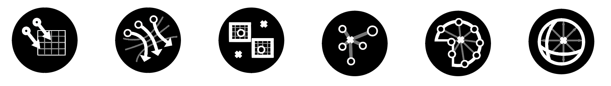
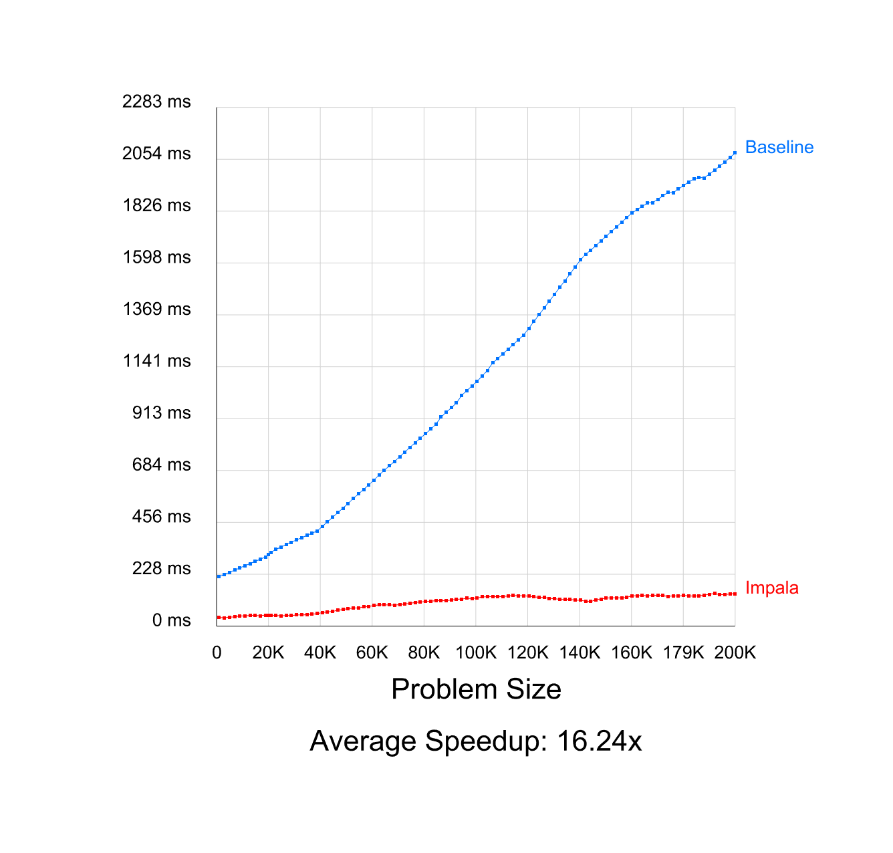
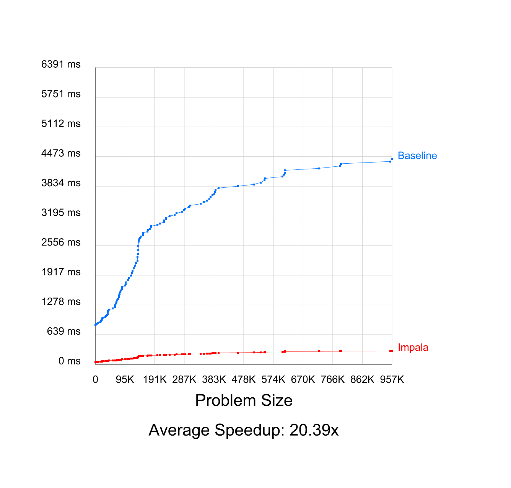
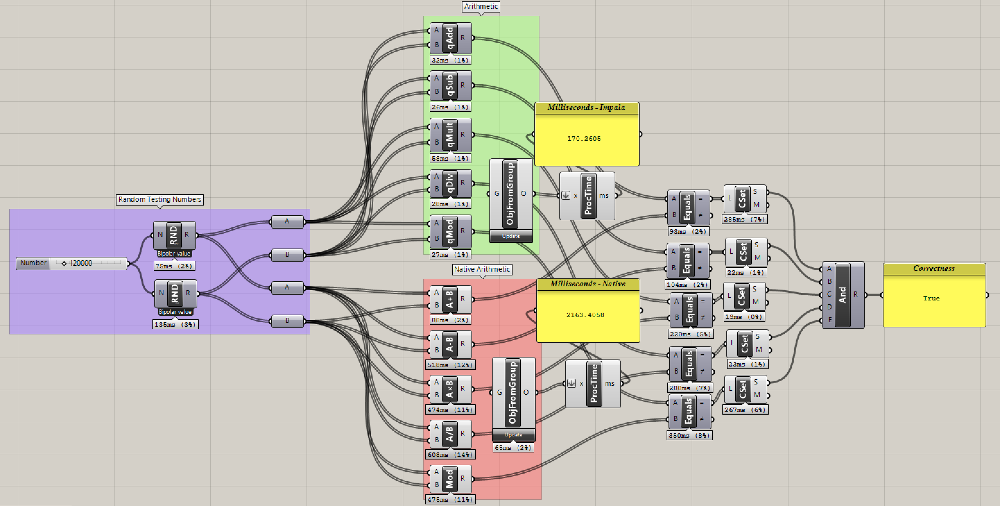
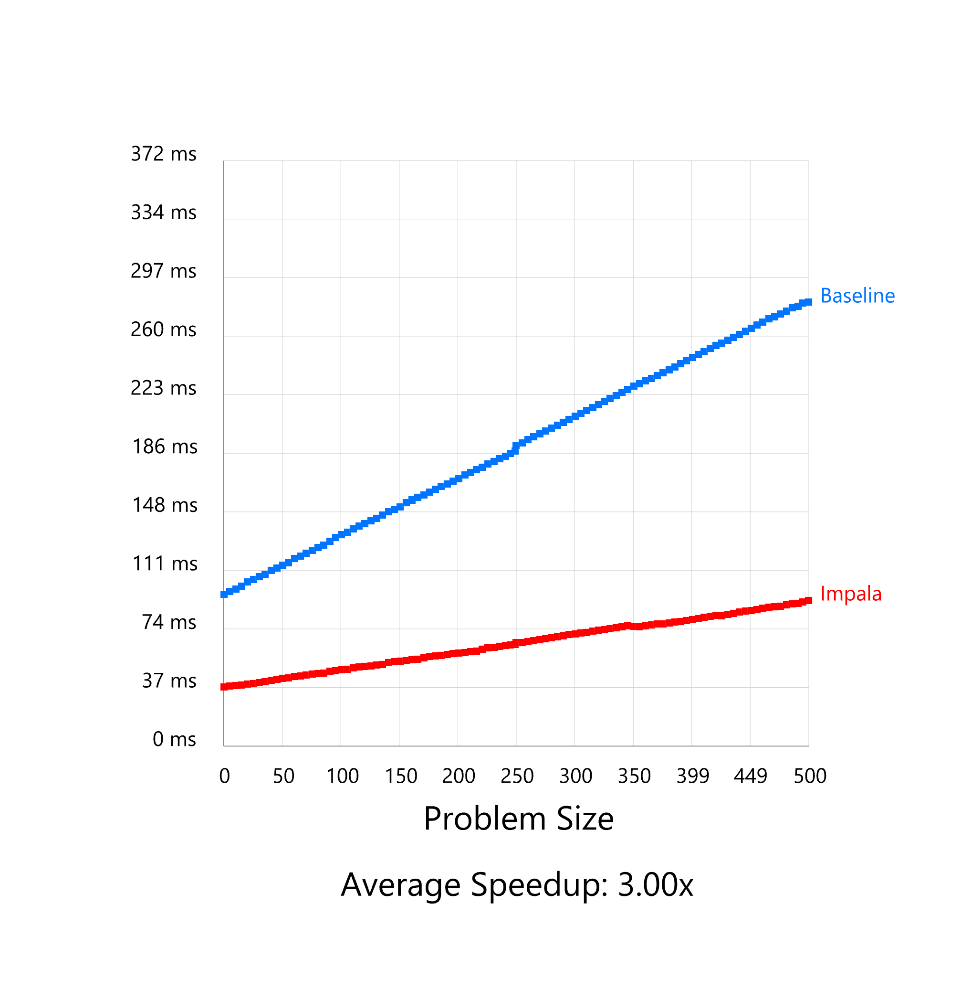
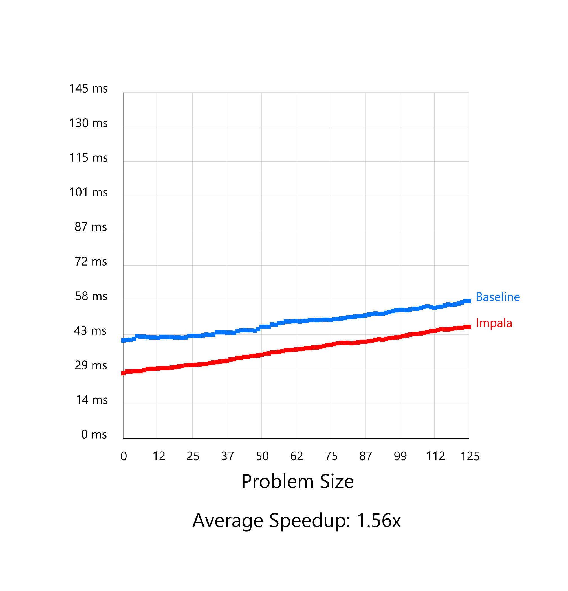
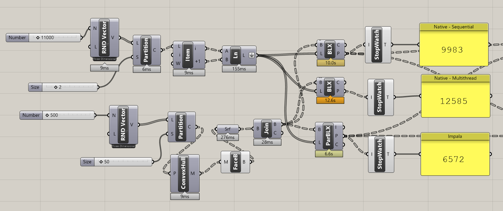
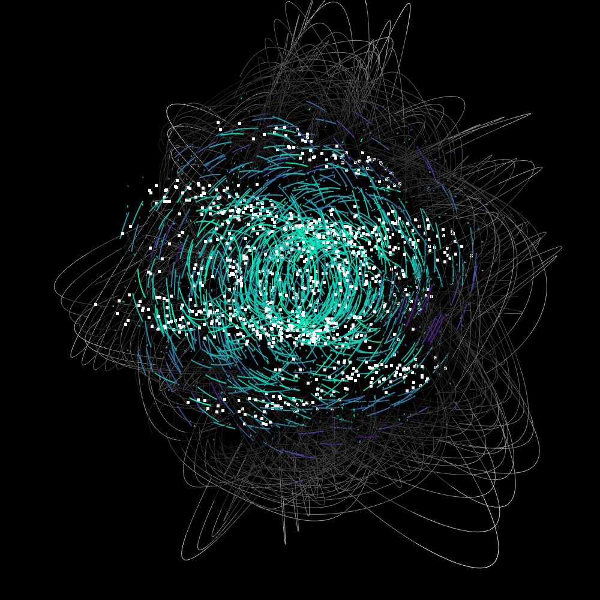

# Impala

### Multithreaded library of performative C# components for Grasshopper

Looking for in-depth documentation and discussion, or how to get started using Impala? [Check out the Wiki](https://github.com/dcascaval/Impala/wiki) for a living document.

---

#### Overview

Grasshopper provides a software environment for rapid scripting and design computation. This environment offers an extremely flexible, visual approach to programming. Impala replicates common **bottleneck Grasshopper operations with a focus on efficiency**, allowing complex scripts and static simulations embedded within Grasshopper to make use of all available computational capacity. This is primarily evident in scripts that deal with thousands of objects or rely heavily on **physically-based information and computation**.

The primary target audience is experienced design computation practitioners and Grasshopper users who are running into the upper bounds of the tool's native, single-core performance, and are willing to take a finer approach to boosting performance at key points. Impala focuses primarily on replicating existing Grasshopper functionality and developing an environment suitable to seamless integration of performant or multithreaded computation within GH. To this end it currently contains three types of components:

- Components that perform identical (or nearly identical) operations to existing Grasshopper components, but do so using a parallel strategy or a better algorithmic complexity (ex: `Closest Point`, `Halton`)
- Components that condense expensive Grasshopper patterns and use imperative methods to significantly reduce the time and space needed to obtain a result (ex: `Closest Curve Closest Point`, `MeshFlow`)
- Components that limit Grasshopper's type-casting system in exchange for performance gains on larger inputs (ex: the `QuickMath` components)

**Impala 1.0 has been released! Grab it on [Food4Rhino](https://www.food4rhino.com/app/impala)**

---

#### Compatibility

- Impala is compatible with Rhinoceros 5 (SR 14), Grasshopper 0.9.0076 and later. Current tests using Rhino 6 and GH 1 indicate no break in functionality.
- Impala uses the latest point-release of C# (7.3 at the time of writing) and is compiled with Visual Studio 2017 on Windows only.

---

#### Benchmarks

- Current benchmarks are available in `/bench`, and are generated primarily using `bencher.gh`. Standalone benchmark files are also used to test for correctness - a typical benchmark will verify correctness and measure performance against the equivalent native implementation to the Impala functionality. For example, a section of the QuickMath benchmark might look like this:

Flat Input                 |  Random input
:-------------------------:|:-------------------------:
  |  

And in Grasshopper:

- Preliminary benchmarks indicate that Impala components are as fast as native GH for all input sizes, and significantly faster for any larger input size. Additionally, Impala components are as fast or faster than the multithreaded GH components in GH1. Unlike those components, however, Impala components are optimised against adversarial input patterns, and can significantly outperform the multithreaded GH1 components in many cases:

Against Curve-Curve SingleThreaded  | Against Curve-Curve Multithreaded
:-------------------------:|:-------------------------:
  |  

A particularly egregious input pattern result:

---

#### Development Milestones (v1.0)

Impala v1 is complete! Check out `notes.md` for progress.

---

#### Propsed Extensions (v2.0)

- ZUI options & FlatMerge
- Dynamic lambda components and branch-matching
- Test `Span<T>` and `ImpalaStructure<T> : IGH_Structure` for memory-efficient copy output
- Profile sub-portions and cache repeat expensive computation
- Implement granularity control across the board, dynamically tune to system
- Offsetting, Booleans (and reductions), Meshfilling algorithms

---

#### Moving Forward

Additional goals for future development include:

- Composition of other expensive operations (occlusion, graph traversals, large scale collisions)
- Automated integration of several Impala components in the form of a macro that searches for locations in a script where Impala could improve GH functionality and substituting the analogous component
- Allowing inter-component parallelism within a group. By maintaining constant inputs and outputs in a group of components, their operation set can be run in parallel, making use of Grasshopper's already visually-explicit dependency graph to structure the computation. This can speed up definitions that don't have a large-operation bottleneck, but may have to perform multiple disjoint sets of computations.

## License

Impala is licensed under the MIT license.

Copyright 2018 Dan Cascaval

Permission is hereby granted, free of charge, to any person obtaining a copy of this software and associated documentation files (the "Software"), to deal in the Software without restriction, including without limitation the rights to use, copy, modify, merge, publish, distribute, sublicense, and/or sell copies of the Software, and to permit persons to whom the Software is furnished to do so, subject to the following conditions:

The above copyright notice and this permission notice shall be included in all copies or substantial portions of the Software.

THE SOFTWARE IS PROVIDED "AS IS", WITHOUT WARRANTY OF ANY KIND, EXPRESS OR IMPLIED, INCLUDING BUT NOT LIMITED TO THE WARRANTIES OF MERCHANTABILITY, FITNESS FOR A PARTICULAR PURPOSE AND NONINFRINGEMENT. IN NO EVENT SHALL THE AUTHORS OR COPYRIGHT HOLDERS BE LIABLE FOR ANY CLAIM, DAMAGES OR OTHER LIABILITY, WHETHER IN AN ACTION OF CONTRACT, TORT OR OTHERWISE, ARISING FROM, OUT OF OR IN CONNECTION WITH THE SOFTWARE OR THE USE OR OTHER DEALINGS IN THE SOFTWARE.